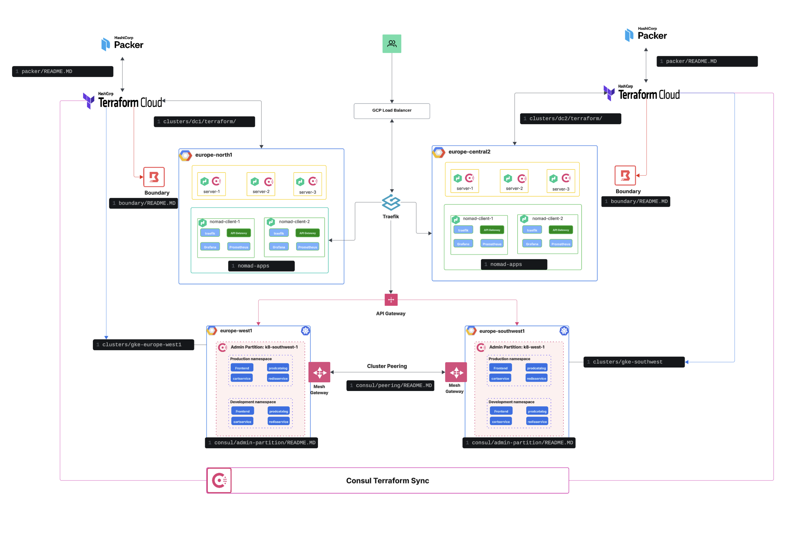

# HashiCorp Enterprise Stack on Google Cloud Platform

## Overview

A demonstration deployment of HashiCorp Consul Enterprise and Nomad Enterprise on Google Cloud Platform with monitoring, security, and enterprise features. 
This repository provides infrastructure-as-code for deploying a complete HashiCorp stack ONLY for demo and PoC purposes. Do not deploy this in Production.

### What This Repository Deploys

This repository creates a complete HashiCorp enterprise ecosystem on GCP including:

**Core Infrastructure:**
- 3 x Consul/Nomad server nodes (combined server architecture)
- 2-4 x Nomad client nodes for application workloads
- GCP Load Balancers with DNS integration

**HashiCorp Services:**
- Consul Enterprise 1.21.0+ent with ACLs and TLS
- Nomad Enterprise 1.10.3+ent with ACLs and secure variables
- Consul Connect service mesh for zero-trust networking
**Applications and Monitoring:**
- Traefik v3.0 API Gateway and load balancer
- Prometheus metrics collection
- Grafana dashboards and alerting
- Demo applications (Terramino game, fake services)

**Security Features:**
- Enterprise ACLs for both Consul and Nomad
- TLS encryption for all HashiCorp services
- Service mesh with Consul Connect
- Firewall rules and network segmentation

# High Level Architecture



## Prerequisites

Before deploying this stack, ensure you have:

**Required Tools:**
- Terraform >= 1.0.0
- Google Cloud SDK (gcloud) authenticated
- Packer >= 1.8.0 (for custom image builds)
- kubectl (for GKE components)
- Task (taskfile) - optional but recommended

**Required Permissions:**
- GCP Project Owner or Editor role
- Ability to create compute instances, networks, and load balancers
- DNS zone management (if using custom domains)

**Required Licenses:**
- Consul Enterprise license
- Nomad Enterprise license

**GCP Setup:**
- GCP project with billing enabled
- Compute Engine API enabled
- DNS API enabled (if using custom domains)
- Service account with appropriate permissions

## How to run in tasks

### 1. Configure Variable Sets (HCP Terraform) or terraform.auto.tfvars

If using HCP Terraform, create these variable sets:

**HashiStack Common Variables:**
```
consul_license = "your-consul-enterprise-license"
nomad_license = "your-nomad-enterprise-license"
consul_version = "1.21.0+ent"
nomad_version = "1.10.3+ent"
consul_bootstrap_token = "ConsulR0cks" # Change in production
enable_acls = true
```

**GCP Common Variables:**
```
gcp_project = "your-gcp-project-id"  
gcp_region = "europe-north1"
machine_type_server = "e2-standard-2"
machine_type_client = "e2-standard-4"
```

**Workspace-Specific Variables:**
```
ssh_public_key = "your-ssh-public-key"
dns_zone = "your-dns-zone-name" # Optional
cluster_name = "your-cluster-name"
```

If not using HCP Terraform, create `terraform.auto.tfvars` files in each cluster directory with these variables.

### 2. Build Custom Images (Required)

Build HashiCorp images with Packer before deploying infrastructure:

```bash
# Build images for your GCP project
task build-images

# Or manually:
cd packer/gcp
packer build .
```

This creates custom images with Consul and Nomad pre-installed and configured.

### 3. Deploy Infrastructure

Choose your deployment approach:

**Single Cluster (DC1):**
```bash
task deploy-dc1
```

**Multi-Cluster (DC1 + DC2):**
```bash
task deploy-both
```

**With Applications:**
```bash
task deploy-dc1
task deploy-monitoring-dc1
task deploy-traefik-dc1
task deploy-demo-apps-dc1
```

## Functionality Breakdown

### Multi-Cluster Peering

For federating multiple Consul datacenters with cluster peering:

**Documentation:** [`consul/peering/README.md`](consul/peering/README.md)

**Quick Start:**
```bash
# Deploy both clusters first
task deploy-both

# Setup peering
task peering:setup
task peering:establish
task peering:complete
```

### Admin Partitions (Multi-Tenancy)

For deploying Consul Enterprise admin partitions on GKE:

**Documentation:** [`consul/admin-partitions/README.md`](consul/admin-partitions/README.md)

**Quick Start:**
```bash
# Deploy base infrastructure
task deploy-dc1

# Deploy GKE clusters with admin partitions
task deploy-all-gke
task gke-setup-secrets
task gke-deploy-consul
```

### Consul Terraform Sync (CTS)

For infrastructure automation with Consul-Terraform-Sync:

**Documentation:** [`consul/cts/README.md`](consul/cts/README.md)

**Features:**
- Automated DNS updates based on service registration
- Infrastructure provisioning triggered by service changes
- Integration with external systems

### Boundary Integration (Optional)

For secure remote access to infrastructure with HashiCorp Boundary:

**Documentation:** [`boundary/README.md`](boundary/README.md)

**Quick Start:**
```bash
# Deploy base infrastructure first
task deploy-dc1

# Configure and deploy Boundary integration
cd boundary/terraform
terraform init
terraform apply
```

## Directory Structure

```
├── clusters/                    # Infrastructure deployments
│   ├── dc1/terraform/          # Primary cluster (europe-north1)
│   ├── dc2/terraform/          # Secondary cluster (europe-central2)
│   └── gke-*/                  # GKE clusters for admin partitions
├── consul/                     # Consul-specific configurations
│   ├── admin-partitions/       # Admin partitions setup
│   ├── peering/               # Cluster peering configuration
│   └── cts/                   # Consul-Terraform-Sync
├── boundary/                   # Boundary integration (optional)
├── packer/                     # Custom image builds
├── nomad-apps/                # Nomad job definitions
└── scripts/                   # Automation and helper scripts
```

## Common Commands

**Infrastructure Management:**
```bash
task deploy-dc1              # Deploy primary cluster
task deploy-dc2              # Deploy secondary cluster  
task deploy-both             # Deploy both clusters
task destroy-dc1             # Destroy primary cluster
task status                  # Check cluster status
```

**Application Deployment:**
```bash
task deploy-monitoring       # Deploy Prometheus + Grafana
task deploy-traefik         # Deploy Traefik load balancer
task deploy-demo-apps       # Deploy sample applications
```

**Cluster Operations:**
```bash
task get-server-ips         # Get instance IP addresses
task ssh-dc1-server         # SSH to DC1 server
task show-urls              # Display all service URLs
task eval-vars              # Show environment variables
```

**Peering and Federation:**
```bash
task peering:setup          # Initialize cluster peering
task peering:establish      # Create peering connection
task peering:verify         # Verify peering status
```

## Access Points

After deployment, services are accessible at:

**HashiCorp UIs:**
- Consul: `http://consul.your-domain.com:8500` or load balancer IP
- Nomad: `http://nomad.your-domain.com:4646` or load balancer IP

**Monitoring:**
- Grafana: `http://grafana.your-domain.com:3000` (admin/admin)
- Prometheus: `http://prometheus.your-domain.com:9090`
- Traefik: `http://traefik.your-domain.com:8080`

**Applications:**
- Terramino Game: `http://terramino.your-domain.com`
- Demo Services: Various ports on client load balancer

## Security Considerations

**Enterprise Features:**
- ACLs enabled by default for Consul and Nomad
- TLS encryption for all inter-service communication
- Enterprise licenses required for advanced features

**Network Security:**
- Firewall rules restrict access to necessary ports only
- Internal communication uses private networks
- Service mesh provides zero-trust networking

**Secrets Management:**
- Sensitive variables marked as sensitive in Terraform
- Nomad secure variables for application secrets
- Consul ACL tokens for service authentication

## Troubleshooting

**Common Issues:**

1. **License Errors**: Ensure valid enterprise licenses are configured
2. **Image Not Found**: Run `task build-images` before deployment
3. **DNS Issues**: Verify DNS zone configuration and permissions
4. **Connectivity**: Check firewall rules and network configuration

**Useful Commands:**
```bash
# Check service status on nodes
sudo systemctl status consul
sudo systemctl status nomad

# View service logs
sudo journalctl -u consul -f
sudo journalctl -u nomad -f

# Check cluster membership
consul members
nomad server members
nomad node status
```

**Getting Help:**
- Check individual README files in each directory for specific functionality
- Review Terraform outputs for connection information
- Use `task status` for overall cluster health
- Examine logs on individual instances for detailed debugging

## Contributing

This repository follows infrastructure-as-code best practices:
- All changes should be made through Terraform
- Test changes in development environments first
- Follow HashiCorp configuration conventions
- Document new features and configurations

For specific functionality (peering, admin partitions, CTS, boundary), refer to the respective README files in each directory.