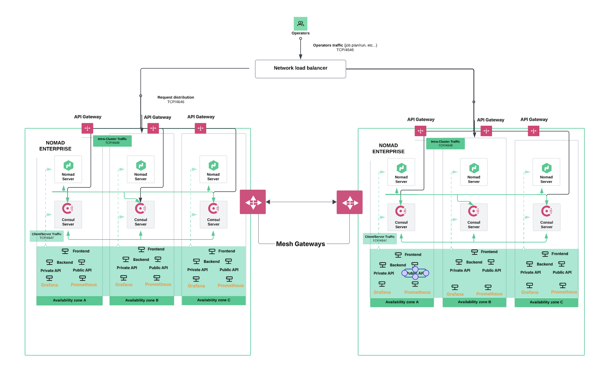

# HashiStack GCP Documentation

> **Complete HashiCorp Consul Enterprise and Nomad Enterprise ecosystem on Google Cloud Platform**

**Quick Navigation:**
- **Getting Started:** [Prerequisites](getting-started/Prerequisites-and-Setup.md) | [Quick Start](getting-started/Quick-Start-Guide.md) | [Architecture](getting-started/Architecture-Overview.md)
- **Infrastructure:** [Packer Images](infrastructure/Image-Building-with-Packer.md) | [VM Clusters](infrastructure/VM-Cluster-Deployment.md) | [GKE](infrastructure/GKE-Cluster-Deployment.md)
- **Advanced Features:** [Admin Partitions](advanced-features/Admin-Partitions.md) | [Cluster Peering](advanced-features/Cluster-Peering.md) | [Boundary](infrastructure/Secure-Access-with-Boundary.md)

---

## Welcome

This documentation provides comprehensive guidance for deploying and managing a production-like HashiCorp stack on Google Cloud Platform. The deployment includes:

- **Enterprise security features** (ACLs, TLS, service mesh)
- **Monitoring and observability** (Prometheus, Grafana, Traefik)
- **Multi-datacenter capabilities** with cluster peering
- **Admin partitions** for multi-tenancy
- **Secure access to infrastructure** with HashiCorp Boundary
- **Infrastructure automation** with Consul-Terraform-Sync (CTS)

**⚠️ Important:** This is designed for demo and proof-of-concept purposes only - not for production use.

## Architecture Overview



### Key Components

| Component | Purpose | Documentation |
|-----------|---------|---------------|
| **Packer** | Image bakery - builds custom VM images with HashiCorp tools pre-installed | [Image Building](infrastructure/Image-Building-with-Packer.md) |
| **Terraform** | Infrastructure automation - deploys networking, compute, and load balancers | [VM Deployment](infrastructure/VM-Cluster-Deployment.md) |
| **Taskfile** | Orchestrates the entire deployment workflow | [Task Automation](workflows/Task-Automation-Reference.md) |
| **Boundary** | Secure access to all servers and clients | [Boundary Integration](infrastructure/Secure-Access-with-Boundary.md) |
| **CTS** | Automates infrastructure changes based on Consul service changes | [Consul-Terraform-Sync](advanced-features/Consul-Terraform-Sync.md) |
| **Consul Enterprise** | Service discovery, configuration, and service mesh | [Admin Partitions](advanced-features/Admin-Partitions.md) |
| **Nomad Enterprise** | Workload orchestration and scheduling | [VM Deployment](infrastructure/VM-Cluster-Deployment.md) |

## Getting Started

New to this project? Follow these steps:

1. **[Prerequisites and Setup](getting-started/Prerequisites-and-Setup.md)** - Install required tools and configure GCP
2. **[Quick Start Guide](getting-started/Quick-Start-Guide.md)** - Deploy your first cluster in 5 steps
3. **[Architecture Overview](getting-started/Architecture-Overview.md)** - Understand the system design

## Documentation Structure

### Getting Started
Start here if you're new to the project.
- [Prerequisites and Setup](getting-started/Prerequisites-and-Setup.md)
- [Quick Start Guide](getting-started/Quick-Start-Guide.md)
- [Architecture Overview](getting-started/Architecture-Overview.md)

### Core Infrastructure
Deploy and manage the foundational infrastructure.
- [Image Building with Packer](infrastructure/Image-Building-with-Packer.md)
- [VM Cluster Deployment](infrastructure/VM-Cluster-Deployment.md)
- [GKE Cluster Deployment](infrastructure/GKE-Cluster-Deployment.md)
- [OpenShift Integration](infrastructure/OpenShift-Integration.md)
- [Secure Access with Boundary](infrastructure/Secure-Access-with-Boundary.md)

### Advanced Features
Implement enterprise features and multi-tenant architectures.
- [Admin Partitions](advanced-features/Admin-Partitions.md)
- [Cluster Peering](advanced-features/Cluster-Peering.md)
- [Consul-Terraform-Sync](advanced-features/Consul-Terraform-Sync.md)
- [Service Intentions](advanced-features/Service-Intentions.md)

### Deployment Workflows
Learn common deployment patterns and workflows.
- [Deployment Workflows](workflows/Deployment-Workflows.md)
- [Task Automation Reference](workflows/Task-Automation-Reference.md)
- [Demo Applications](workflows/Demo-Applications.md)

### Operations
Maintain, monitor, and troubleshoot your deployment.
- [Monitoring and Observability](operations/Monitoring-and-Observability.md)
- [Troubleshooting Guide](operations/Troubleshooting-Guide.md)
- [Maintenance and Cleanup](operations/Maintenance-and-Cleanup.md)

## Common Use Cases

### Single Datacenter Deployment
Perfect for testing and development environments.
```bash
task build-images      # Build custom images
task deploy-dc1        # Deploy infrastructure
task eval-dc1          # Get connection details
nomad setup consul -y  # Configure integration
```
[Full Guide](workflows/Deployment-Workflows.md#single-datacenter)

### Multi-Datacenter with Peering
Connect multiple datacenters with secure service mesh communication.
```bash
task build-images
task deploy-both-dc
task eval-both
task -t consul/peering/Taskfile.yml consul:deploy-all
```
[Full Guide](workflows/Deployment-Workflows.md#multi-datacenter-with-peering)

### Admin Partitions on Kubernetes
Deploy multi-tenant Consul partitions on GKE clusters.
```bash
task build-images
task deploy-dc1
task deploy-both-gke
task -t consul/admin-partitions/Taskfile.yml consul:deploy-all
```
[Full Guide](advanced-features/Admin-Partitions.md)

## Quick Access

**After deployment, access your services:**
- **Consul UI:** `http://<server-ip>:8500`
- **Nomad UI:** `http://<server-ip>:4646`
- **Grafana:** `http://<client-ip>:3000` (admin/admin)
- **Prometheus:** `http://<client-ip>:9090`

Get all URLs with: `task show-dc1-info`

## Need Help?

- **Troubleshooting:** See [Troubleshooting Guide](operations/Troubleshooting-Guide.md)
- **Task Reference:** Run `task --list` or see [Task Automation](workflows/Task-Automation-Reference.md)
- **Component Docs:** Navigate to specific feature pages above

---

**[Start with Prerequisites →](getting-started/Prerequisites-and-Setup.md)**
